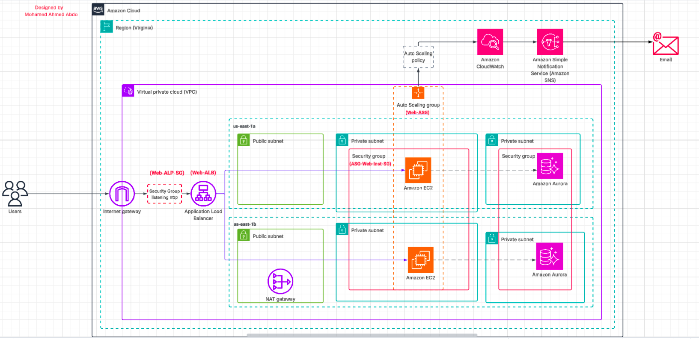

# Deploy a Web Application on AWS using an Auto Scaling Group

This project provides a comprehensive, step-by-step guide to deploying a scalable and robust web application on AWS. It walks through setting up a Virtual Private Cloud (VPC), configuring networking, launching web servers, creating a custom AMI, and deploying an Application Load Balancer and Auto Scaling Group. It is ideal for learners and professionals seeking hands-on experience with core AWS services.

---

## 📚 Table of Contents
- [🧰 Prerequisites](#-prerequisites)
- [🧱 Project Architecture Overview](#-project-architecture-overview)
- [📡 VPC Configuration](#-vpc-configuration)
- [🔗 Create an S3 VPC Endpoint](#-create-an-s3-vpc-endpoint)
- [🌐 Launch Web Server Instance](#-launch-web-server-instance)
- [🔐 Connect to the Instance via Session Manager (Optional)](#-connect-to-the-instance-via-session-manager-optional)
- [📸 Create a Custom AMI](#-create-a-custom-ami)
- [⚖️ Create an Application Load Balancer (ALB)](#️-create-an-application-load-balancer-alb)
- [📄 Create a Launch Template](#-create-a-launch-template)
- [🚀 Create an Auto Scaling Group (ASG)](#-create-an-auto-scaling-group-asg)
- [🗄️ Set up a Database](#️-set-up-a-database)
- [🔐 Manage the Database Credentials with Secrets Manager](#-manage-the-database-credentials-with-secrets-manager)
- [🖥️ Allow the Web Server to Access the Secret](#️-allow-the-web-server-to-access-the-secret)
- [🔧 Create an SNS Topic and Subscribtion To Send Email](#-create-an-sns-topic-and-subscribtion-to-send-email)
- [📊 CloudWatch : Monitor Performance and Send Alerts](#-cloudwatch--monitor-performance-and-send-alerts)
- [🚀 Validate the Setup](#-validate-the-setup)
- [🧪 Testing the Deployment](#-testing-the-deployment)
- [🧼 Optional Cleanup](#-optional-cleanup)
- [🧑‍💻 Author](#-author)
- [📜 License](#-license)
- [ Project (Video)](#project-implementation-video)


---

## 🧰 Prerequisites

- An AWS account (Free Tier eligible)
- Basic understanding of AWS services like EC2, VPC, IAM
- SSH key pair (to access EC2 if needed)
- This project follows the [AWS General Immersion Day – Advanced Web Application Module](https://aws.amazon.com/architecture/immersion-day/)

---

## 🧱 Project Architecture Overview

The deployed infrastructure includes:

- VPC with 2 public and 4 private subnets across 2 Availability Zones
- S3 Gateway Endpoint for private subnet access
- Web Server instances (LAMP stack)
- Custom AMI based on configured web server
- Application Load Balancer (ALB)
- Launch Template & Auto Scaling Group
- IAM Roles for EC2 Session Manager access



---

## 📡 VPC Configuration

1. Navigate to **VPC > Create VPC**
2. Choose:
   - **Resources to create**: VPC and more
   - **Name**: `VPC-Manara`
   - **IPv4 CIDR block**: `192.168.0.0/16`
   - **Availability Zones**: 2
   - **Public Subnets**: `192.168.1.0/24`, `192.168.2.0/24`
   - **Private Subnets**: `192.168.101.0/24`, `192.168.102.0/24`
   - **NAT Gateway**: In 1 AZ
   - **DNS hostnames** and **DNS resolution**: Enabled

---

## 🔗 Create an S3 VPC Endpoint

1. Go to **VPC > Endpoints > Create Endpoint**
2. Name it `S3-endpoint`
3. Choose:
   - **Service**: S3 (Gateway)
   - **VPC**: `VPC-Lab`
   - **Route Tables**: Select private subnets
   - **Policy**: Full Access

---

## 🌐 Launch Web Server Instance

1. Go to **EC2 > Launch Instance**
2. Configure:
   - AMI: Amazon Linux 2
   - Instance type: `t2.micro`
   - VPC: `VPC-Manara`, Public Subnet
   - Security Group: Allow `SSH (22)` and `HTTP (80)`
   - Metadata: Set to **V2 only**
3. Add the following **User Data** script to install the app:

   ```bash
   #!/bin/sh
   ​
   #Install a LAMP stack
   dnf install -y httpd wget php-fpm php-mysqli php-json php php-devel
   dnf install -y mariadb105-server
   dnf install -y httpd php-mbstring
   ​
   #Start the web server
   chkconfig httpd on
   systemctl start httpd
   ​
   #Install the web pages for our lab
   if [ ! -f /var/www/html/immersion-day-app-php7.zip ]; then
      cd /var/www/html
      wget -O 'immersion-day-app-php7.zip' 'https://static.us-east-1.prod.workshops.aws/public/444df362-a211-4686-869b-77496f0dd3be/assets/immersion-day-app-php7.zip'
      unzip immersion-day-app-php7.zip
   fi
   ​
   #Install the AWS SDK for PHP
   if [ ! -f /var/www/html/aws.zip ]; then
      cd /var/www/html
      mkdir vendor
      cd vendor
      wget https://docs.aws.amazon.com/aws-sdk-php/v3/download/aws.zip
      unzip aws.zip
   fi
   ​
   # Update existing packages
   dnf update -y

4. Launch the instance.
5. Once the instance is running, visit the **Public IPv4 address** in your browser to verify that the PHP application loads successfully.


---

## 🔐 Connect to the Instance via Session Manager (Optional)

1. Create an IAM role with the policy `AmazonSSMManagedInstanceCore`.
2. Attach the IAM role to the instance.
3. Make sure the instance is reachable or has the SSM endpoint in private subnets.
4. Use Systems Manager > Session Manager to start a terminal session.

---

## 📸 Create a Custom AMI

1. Select the configured web server EC2 instance.
2. Go to **Actions > Image > Create Image**.
3. Name the image `Web Server version1`.
4. Wait for the image to be available under **AMIs**.

---

## ⚖️ Create an Application Load Balancer (ALB)

1. Go to **EC2 > Load Balancers > Create Load Balancer**.
2. Choose **Application Load Balancer**.
3. Configure:

   * Name: `Web-ALB`
   * Scheme: Internet-facing
   * Listeners: HTTP (Port 80)
   * VPC: `VPC-Manara`
   * Subnets: Select **public subnets**
4. Create a new security group:

   * Name: `Web-ALP-SG`
   * Inbound: Allow HTTP (80) from anywhere
5. Configure routing:

   * Create a target group: `Web-TG`
   * Target type: Instances
   * Protocol: HTTP
   * Port: 80
   * VPC: `VPC-Manara`
6. Register your running web server instance to the target group.
7. Complete the ALB creation and test by visiting the ALB DNS name in your browser.

---

## 📄 Create a Launch Template

1. Go to **EC2 > Launch Templates > Create launch template**.
   * Name: `web-launch-template`
   * AMI: Select `Web-Server-V1`
   * Instance type: `t2.micro`
   * Key pair: Optional
   * Network settings:
      * Select a security group allowing HTTP (80) access (e.g., `ASG-Web-Inst-SG`)
   * IAM Instance Profile: `SSMInstanceProfile` (if using SSM)
   * Add a Name tag: `Web Instance`
---

## 🚀 Create an Auto Scaling Group (ASG)

1. Go to **EC2 > Auto Scaling Groups > Create Auto Scaling group**.
   * Name: `web-asg`
   * Launch Template: Choose `web-launch-template`
   * Network: `VPC-Manara`
      * Select **private subnets**
   * Attach the Auto Scaling group to the **existing target group**: `Web-TG`
   
   * Configure group size:
      * Desired capacity: `2`
      * Minimum capacity: `2`
      * Maximum capacity: `4`

   * Scaling policies:
      * Choose **Target tracking scaling policy**
      * Metric type: Average CPU utilization
      * Target value: `30`


---

## 🗄️ Set up a Database

### Create a VPC Security Group for the Database

1. Create a security group allowing MySQL/Aurora inbound from ASG security group (e.g., `ASG-Web-Inst-SG`)
   * Name : `DB-SG`

### Create RDS Instance

1. Go to **RDS > Create database**.
   * Creation method: **Standard create**  → Engine: **Aurora**  → Production template.
   * Set DB cluster ID and credentials.
   * Select `VPC-Manara` and DB subnet group.
   * Select DB Security Group.(e.g., `DB-SG`)

---

## 🔐 Manage the Database Credentials with Secrets Manager

1. Search for **Secrets Manager**.
   * Create new secret: select **Credentials for RDS database**.
   * Enter username and password.
   * Name : (e.g., `rds-secret`).

---

## 🖥️ Allow the Web Server to Access the Secret

1. Attach an IAM policy to the web server's role allowing read access to the secret.
2. Modify instance profile to include this policy.

---

## 🔧 Create an SNS Topic and Subscribtion To Send Email

### 🔧 Step 1: Create an SNS Topic

1. Go to **SNS > Topics > Create topic**.
    * Select **Standard** as the topic type.
    * Name the topic, e.g., `webapp-alerts`.

### 📬 Step 2: Subscribe to the SNS Topic

1. In the newly created topic,  **Create subscription**.
   * Protocol: **Email** , Endpoint: Enter your email address.
---

## 📊 CloudWatch : Monitor Performance and Send Alerts

### 📈 Step 1: Create a CloudWatch Alarm for CPU Utilization

1. Go to **CloudWatch** → **Alarms** → **Create alarm**.
    Click **Select metric** → Browse → **EC2** → **Per-Instance Metrics**.
    Select the **CPUUtilization** metric for your Auto Scaling instances.

    Configure the Alarm:

    * **Statistic**: Average
    * **Period**: 5 minutes
    * **Threshold type**: Static
    * **Whenever CPUUtilization is...**: Greater than `30%`

### 🚨 Step 2: Set Notification Action

1. **Notification**: Check **In alarm**.
2. **Send a notification to**: Select your previously created topic `webapp-alerts`.
3. **Create Alarm**.

---

## ✅ Validate the Setup

* Go to **EC2 > Auto Scaling Groups** and ensure 2 instances are launched in the private subnets.
* Visit the **ALB DNS name** in a browser to confirm that traffic is balanced across ASG instances.
* Stop one instance and verify ASG automatically replaces it.
* Monitor CPU usage to trigger scaling.

---

## 🧪 Testing the Deployment

* Access the **ALB DNS name** in your browser.
* Verify that the web application loads correctly.
* Test auto-scaling by:

  1. Clicking the **"LOAD TEST"** button in the app.
  2. Monitoring **CPU utilization** in **CloudWatch**.
  3. Confirming new EC2 instances launch when CPU exceeds threshold.
* After load subsides, verify instances are automatically terminated to scale down.

---
## 🧼 Optional Cleanup

To avoid unnecessary charges:

* Delete Auto Scaling Group
* Delete ALB and Target Group
* Deregister and delete AMI
* Remove EC2 instances
* Delete Launch Template
* Delete VPC and associated components

---

## 🧑‍💻 Author

GitHub: [@MohamedAhmedAbdo](https://github.com/yourusername)

LinkedIn: [linkedin.com/in/mohamed-abdo-19abdo97](https://linkedin.com/in/yourprofile)

---

## 📜 License

This project is licensed under the MIT License. See the `LICENSE` file for more information.

---
## Project Implementation (Video)

Video : https://drive.google.com/drive/folders/1PFkgZeJoz1pwwN2rgYeZT_lAw_A3gPLx?usp=sharing
